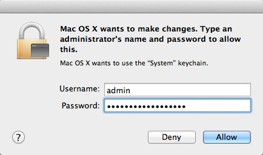

airport-autojoin
================

**TL;DR Summary:** a [mac os x specific] shell script to automatically join Wi-Fi/AirPort networks

## Details ##

I came across this question on [AskDifferent] and it reminded me that I had dealt with the same problem with one of my Macs awhile ago.

   [AskDifferent]: http://apple.stackexchange.com/questions/89616/osx-wont-automatically-connect-to-wifi

I dug out the shell script that I had written to "solve" the problem, and then (of course) decided to re-write it, even though I'm not having the problem now.

The idea is very simple:

* use the `airport` command<a style="text-decoration: none;" href="#fn-1">[1]</a> to check to see if we are connected to a Wi-Fi network:

	* If we are connected to a Wi-Fi network already, exit

	* If we are *not* connected to a Wi-Fi network, scan for local available networks.

* Compare available SSIDs against a list of "known SSIDs" (which you have to add to the script):
	* if none are available, exit
	* if one is available, try to join it using the `networksetup` command.

That's pretty much it.

## launchd ##

This script can be called two ways:

1.	directly through the command line.
2.	via `launchd` which will automatically run it

Put the `airport-autojoin.sh` in /usr/local/bin/
and then install [com.tjluoma.on-network-change.plist] to `/Library/LaunchDaemons` (which will make sure that it is run as `root`).

[com.tjluoma.on-network-change.plist]: https://github.com/tjluoma/airport-autojoin/blob/master/com.tjluoma.on-network-change.plist

## Authentication ##

The shell script needs to run as root in order to run the `networksetup` command. If you run it via `launchd` as recommended above it will be run as root.

The firs time you run this script, you may be asked to authenticate with a message like this:

If so, just enter your login name and password.

## Update 2014-11-13

[com.tjluoma.joinwifi.plist](com.tjluoma.joinwifi.plist) is another attempt to solve this problem, but it doesn’t try to get very fancy about it, it just uses a straight up call to tell `airport` to join the strongest Wi-Fi network.

To use this, you only need to use the `com.tjluoma.joinwifi.plist` and if you use the other method, you do not need to use `com.tjluoma.joinwifi.plist`. Pick one.

### Configure

***Important!*** If your Wi-Fi port is _not_ `en0` (it may be `en1` or something else, under odd circumstances)
you _must_ change this line in `com.tjluoma.joinwifi.plist`:

		<string>en0</string>

### Install

Once you have that set correctly, save it to `/Library/LaunchDaemons/com.tjluoma.joinwifi.plist` and make sure that it is owned by `root` with the proper permissions.

Set Permissions:

	chmod 644 /Library/LaunchDaemons/com.tjluoma.joinwifi.plist

Move file into place:

	sudo mv -vn com.tjluoma.joinwifi.plist /Library/LaunchDaemons/com.tjluoma.joinwifi.plist

Change owner/group (required by `launchd`):

	sudo chown root:wheel /Library/LaunchDaemons/com.tjluoma.joinwifi.plist

Load file into `launchd`

	sudo launchctl load /Library/LaunchDaemons/com.tjluoma.joinwifi.plist

### Uninstall

You can remove the file with two commands:

Remove it from `launchd`:

	sudo launchctl unload /Library/LaunchDaemons/com.tjluoma.joinwifi.plist

Delete the `launchd` plist:

	sudo /bin/rm /Library/LaunchDaemons/com.tjluoma.joinwifi.plist

## Footnote ##

<ol>
<li id="fn-1">
		
 You know about the `airport` command, right? It's located at /System/Library/PrivateFrameworks/Apple80211.framework/Versions/Current/Resources/airport although I always link it to /usr/local/bin/airport as soon as I setup a new Mac.
 <a title="Return to article" href="#airport">↩</a>

</li>
</ol>

